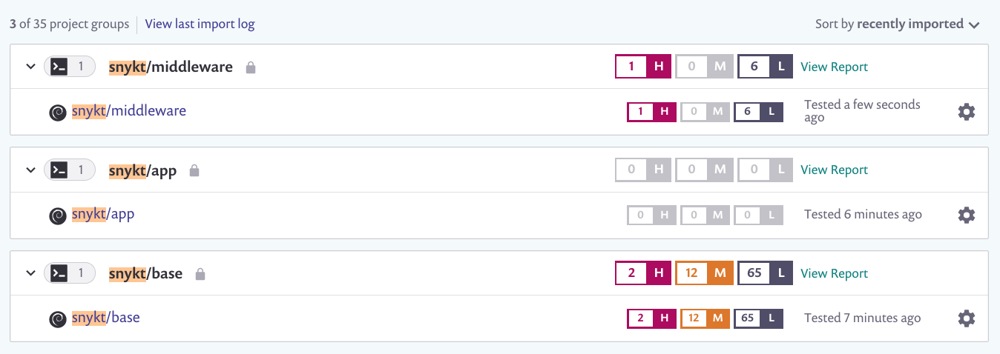

# Snykt

An example project using a hierarchy of images and using Snyk to test each in turn. This should be relevant in organisations where a central team or teams maintains some images which are then used by several application teams.



## Image hierarchy

### Base

This is our internal base image. It's maintained by a central team who are resonsible for any vulnerabilities in it. This is why we're not using a multi-stage Dockerfile here, because each Dockerfile, and the resulting image, is owned by a separate team.

For our demo the Dockerfile looks like:

```dockerfile
FROM python:slim
```

In reality you might have several images at this level, or another level of hierarchy. You might provide some level of security hardening configuration or similar here depending on the nature of your base image.

### Middleware

In this example our middleware image inherits from our base, and adds in some components that all app teams need.

```dockerfile
FROM snykt/base

RUN apt-get update && apt-get install -y \
    gunicorn \
    sqlite3 \
    && rm -rf /var/lib/apt/lists/
```

In our hypothetical example that includes a local database in `sqlite3` and a Python application server `gunicorn`.

### App

Finally we have the Dockerfile for our app. It's a _very_ simple Python application that we're going to run with the application server from our middleware image.

```dockerfile
FROM snykt/middleware

EXPOSE 8080

WORKDIR /app
ADD app.py .

CMD ["gunicorn", "-w", "4", "app:app"]
```

## Snyk

With the above images built you can test the images for vulnerabilities using Snyk. For the following demo we'll use `snyk test` which outputs the results to the console. You can also use `snyk monitor` to send the data to Snyk for display and reporting.

First let's test our `snyky/base` base image as usual.

```console
$ snyk container test snykt/base --file=base/Dockerfile
...
✗ High severity vulnerability found in sqlite3/libsqlite3-0
  Description: Out-of-bounds Read
  Info: https://snyk.io/vuln/SNYK-DEBIAN10-SQLITE3-570723
  Introduced through: sqlite3/libsqlite3-0@3.27.2-3
  From: sqlite3/libsqlite3-0@3.27.2-3
  Introduced by your base image (python:slim)

✗ High severity vulnerability found in perl/perl-base
  Description: Integer Overflow or Wraparound
  Info: https://snyk.io/vuln/SNYK-DEBIAN10-PERL-570802
  Introduced through: meta-common-packages@meta
  From: meta-common-packages@meta > perl/perl-base@5.28.1-6
  Introduced by your base image (python:slim)
  Fixed in: 5.28.1-6+deb10u1


Organization:      garethr
Package manager:   deb
Target file:       base/Dockerfile
Project name:      docker-image|snykt/base
Docker image:      snykt/base
Base image:        python:slim
Licenses:          enabled

Tested 94 dependencies for known issues, found 78 issues.

According to our scan, you are currently using the most secure version of the selected base image
```


Because the vulnerabilities in the base image are the responsibility of the central team, the middleware team can focus just on vulnerabilities introduced by them. For this we use the `--excluse-base-image-vulns` flag.

```console
$ snyk container test snykt/middleware --file=middleware/Dockerfile --exclude-base-image-vulns
...
✗ Medium severity vulnerability found in sqlite3/libsqlite3-0
  Description: CVE-2020-13631
  Info: https://snyk.io/vuln/SNYK-DEBIAN10-SQLITE3-570487
  Introduced through: sqlite3/libsqlite3-0@3.27.2-3, sqlite3@3.27.2-3, python-defaults/libpython-stdlib@2.7.16-1
  From: sqlite3/libsqlite3-0@3.27.2-3
  From: sqlite3@3.27.2-3 > sqlite3/libsqlite3-0@3.27.2-3
  From: python-defaults/libpython-stdlib@2.7.16-1 > python2.7/libpython2.7-stdlib@2.7.16-2+deb10u1 > sqlite3/libsqlite3-0@3.27.2-3
  and 1 more...
  Introduced in your Dockerfile by 'RUN apt-get update && apt-get install -y gunicorn sqlite3 && rm -rf /var/lib/apt/lists/*'

✗ High severity vulnerability found in sqlite3/libsqlite3-0
  Description: Out-of-bounds Read
  Info: https://snyk.io/vuln/SNYK-DEBIAN10-SQLITE3-570723
  Introduced through: sqlite3/libsqlite3-0@3.27.2-3, sqlite3@3.27.2-3, python-defaults/libpython-stdlib@2.7.16-1
  From: sqlite3/libsqlite3-0@3.27.2-3
  From: sqlite3@3.27.2-3 > sqlite3/libsqlite3-0@3.27.2-3
  From: python-defaults/libpython-stdlib@2.7.16-1 > python2.7/libpython2.7-stdlib@2.7.16-2+deb10u1 > sqlite3/libsqlite3-0@3.27.2-3
  and 1 more...
  Introduced in your Dockerfile by 'RUN apt-get update && apt-get install -y gunicorn sqlite3 && rm -rf /var/lib/apt/lists/*'


Organization:      garethr
Package manager:   deb
Target file:       middleware/Dockerfile
Project name:      docker-image|snykt/middleware
Docker image:      snykt/middleware
Base image:        snykt/base
Licenses:          enabled

Tested 115 dependencies for known issues, found 21 issues.
```

Note here we _only_ identified the vulnerabilities introduced by the middleware image, in this case from the `sqlite3` package. The output also shows which statement in the Dockerfile introduced the vulnerable package.

Finally the application teams can build there images on top of the middleware image, and are then responsible for the vulnerabilities that they introduce.

```console
$ snyk container test snykt/app --file=app/Dockerfile --exclude-base-image-vulns
Testing snykt/app...


Organization:      garethr
Package manager:   deb
Target file:       app/Dockerfile
Project name:      docker-image|snykt/app
Docker image:      snykt/app
Base image:        snykt/middleware
Licenses:          enabled

Tested 115 dependencies for known issues, found 0 issues.
```

In this case the applicaton team haven't introduced any additional vulnerabilities and can rely on the middleware and base image teams for upstream fixes.

## Demo

If you'll like a quick way to run the demo see the `Makefile`. To build each of the images run:

```console
make
```

Then to test each of the images with Snyk you can run.

```console
make snyk-base
make snyk-middleware
make snyk-app
```

This requires you to have both Docker and Snyk installed and working.
